*NOTE:* This file is a template that you can use to create the README for your project. The *TODO* comments below will highlight the information you should be sure to include.

# Capstone Project For Azure Machine Learning Nanodegree by Ikechukwu Ogbuchi

This final project was completed as part of the requirements to conclude the  Machine Learning Engineer with Microsoft Azure Nanodegree Program. We were to choose a dataset of our choice and practice building and optimizing models using the tools from Azure. I chose to solve the Zindi Africa HAckathon challenge on predicting building insurance claims for this final project. It contains 7,160 rows of building data and column features which are to be used for prediction. The goal is to predict the "Claim" column which serves as target.

I used both AutoML and HyperDrive to successfully conclude this project. I compared the performance of the both of them in predicting the value of the "Claim" column and I deployed the better performing model as an enpoint which in my case turned out to be the HyperDrive model with an accuracy of **81%** as compared to AutoML's **79%.**

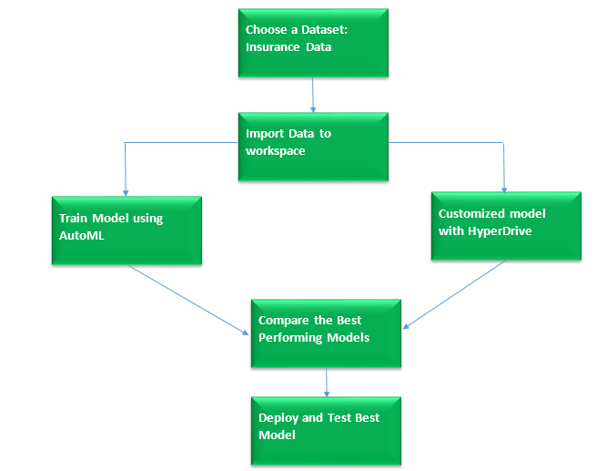


## Dataset
The Dataset I chose was from this competition, [Zindi Africa Insurance Prediction](https://zindi.africa/competitions/data-science-nigeria-2019-challenge-1-insurance-prediction/leaderboard).

It contains 7160 rows and 15 Columns. Description of Variables are as follows:

**Variable	Description**

**Customer Id:**	Identification number for the Policy holder

**YearOfObservation:**	year of observation for the insured policy

**Insured_Period:**	duration of insurance policy in Olusola Insurance. (Ex: Full year insurance, Policy Duration = 1; 6 months = 0.5

**Residential**	is the building a residential building or not

**Building_Painted**	is the building painted or not (N-Painted, V-Not Painted)

**Building_Fenced**	is the building fence or not (N-Fenced, V-Not Fenced)

**Garden	building:** has garden or not (V-has garden; O-no garden)

**Settlement	Area:** where the building is located. (R- rural area; U- urban area)

**Building Dimension**	Size of the insured building in m2

**Building_Type:**	The type of building (Type 1, 2, 3, 4)

**Date_of_Occupancy:**	date building was first occupied

**NumberOfWindows:**	number of windows in the building

**Geo Code:**	Geographical Code of the Insured building

**Claim:**	target variable. (0: no claim, 1: at least one claim over insured period).

### Overview
The problem was to predict the value of the Claim target column on a new dataset. Since I am predicting a discrete value here, I knew it was a classification problem, so I used the LogisticRegression Classifier for my Hyperdrive.

### Task
The task I did here was classification task to predict the target column which is claim. I used all of the features in the variable description except the Customer ID. The Settlement, Garden, Building_Painted and Building_Fenced features were not directly used in the model. After I had employed One-Hot encoding to numerically represent the categorical variables, I dropped off these categorical columns leaving behind the encoded colums that came as a result.

### Access
for ease of access, I had downloaded the dataset and hosted it on my [Github repository](https://raw.githubusercontent.com/Ogbuchi-Ikechukwu/Azure-ML-Nanodegree-Capstone/master/test_data_cleaned.csv). Then I got it through this external link into Microsoft Azure. The Dataset python class easily enbled me do this as shown below:

```python
    # Create AML Dataset and register it into Workspace
    example_data = 'https://raw.githubusercontent.com/Ogbuchi-Ikechukwu/Azure-ML-Nanodegree-Capstone/master/starter_file/train_data_cleaned.csv'
    dataset = Dataset.Tabular.from_delimited_files(example_data)
    #Register Dataset in Workspace
    dataset = dataset.register(workspace=ws,
                               name=key,
                               description=description_text)
  data = dataset.to_pandas_dataframe()
```

## Automated ML
For the AutoML experiment I used the vm_size of 'STANDARD_D2_V2' and set max_nodes as 4.
I also used the following settings and configs:
```python
  automl_settings = {
    "experiment_timeout_minutes":30,
    "enable_early_stopping":True,
    "max_concurrent_iterations":5,
    "primary_metric": "accuracy",
    "iteration_timeout_minutes": 5,
    "featurization": 'auto',
    "verbosity": logging.INFO
}

# TODO: Put your automl config here
automl_config = AutoMLConfig(
    experiment_timeout_minutes=30,
    compute_target=compute_cluster,
    task='classification',
    primary_metric='accuracy',
    training_data=train_data,
    label_column_name='Claim',
    n_cross_validations=4)
```
*experiment_timeout_minutes*  is used to define how long, in minutes, your experiment should continue to run.

*enable_early_stopping* lets you define if you want to enable early stopping or not

*max_concurrent_iterations* specifies the maximum number of concurrent  your experiment is allowed

*primary_metric* defines the primary metric you wish to use. In my case I chose accuracy

*iteration_timeout_minutes* defines how long each iteration sould run

*featurization* enables your ML experiment to automatically scale or normalize your data

*verbosity* is used to turn on verbose logging when you submit the experiment

*task* specifies what kind of ML task to perform. In this case classification

*label_column_name* specifies the target(predicted) column name

*n_cross_validations* specifies the number of cross validations you want your model to use

### Results

Out of all the 100 experiments that AutoML ran, the **VotingEnsemble** model performed best with an accuracy of **79%**
Some of the identified parameters of the model are shown in the screenshot below:

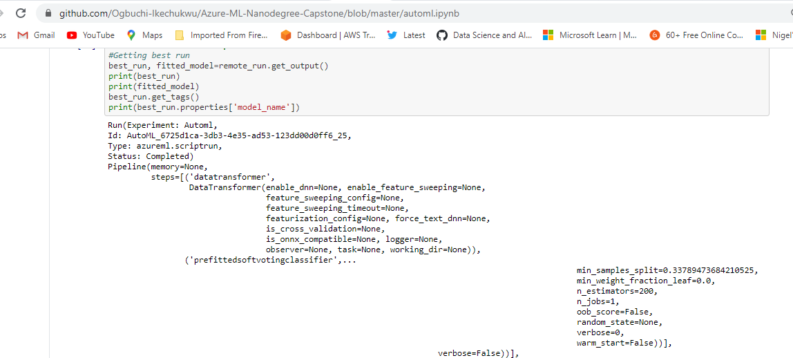

How could I have improved it?
I could improve the results of the auto ML by disabling early stopping and getting more training data fro the classification model.
RunDetails widget outputs are shown below:
Best Model:
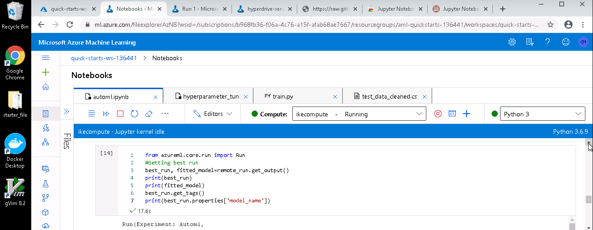
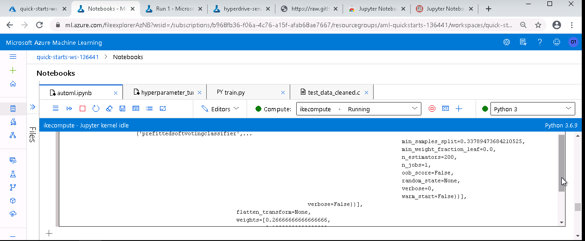
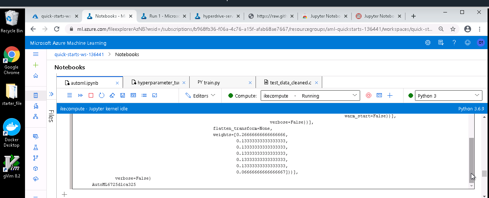
Run Details:
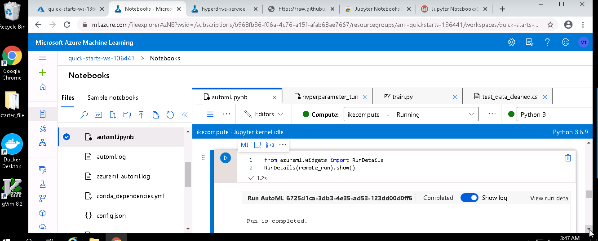
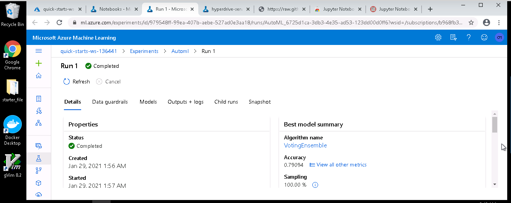
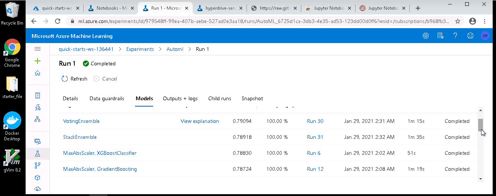

## Hyperparameter Tuning

I chose the Logistic Regression model from Scikit Learn because it is easier to implement and interpret. It is also very efficient to train.

The parameters I have used for my Hyperdrive config are shown in the snippet below:
```python
early_termination_policy = BanditPolicy(slack_factor = 0.01)

# Create the different params that you will be using during training
param_sampling = RandomParameterSampling( {
    '--C': uniform(0.001, 1.0),
    '--max_iter': choice(50, 150, 1000)
} )

# Create your estimator and hyperdrive config
src = ScriptRunConfig(source_directory=project_folder,
                      script='train.py',
                      compute_target=compute_target,
                      environment=sklearn_env)

hyperdrive_config = HyperDriveConfig(run_config=src,
                                     hyperparameter_sampling=param_sampling,
                                     policy=early_termination_policy,
                                     primary_metric_name='Accuracy',
                                     primary_metric_goal=PrimaryMetricGoal.MAXIMIZE,
                                     max_total_runs=100)

```

--C represents the inverse of regularization strenght I have set it to randomly choose values from a uniform distribution between 0.001 and 1.0.
--max_iter is a parameter that represents the maximum number of iterations it sould take for model to converge. I have sampled it from one of three values given as 50, 150, 1000

### Results
From the HyperDrive model, I got a best score of **81%** from one of the child runs. Parameters included --C as **uniform(0.001, 1.00)**, --max_iter from choice **(50,150,1000)** , policy as early_termination_policy, random paramter sampling and accuracy as primary metric. I could have improved this by increasing the range of parameters for the --max_iter, so the model iterations can run for longer.

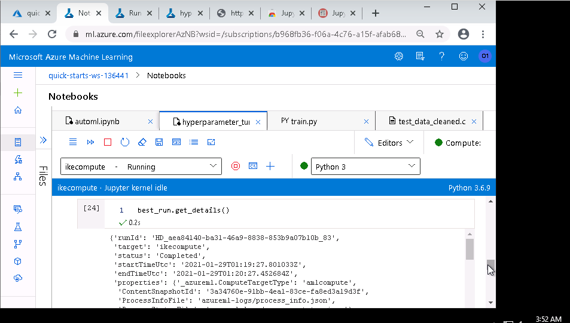
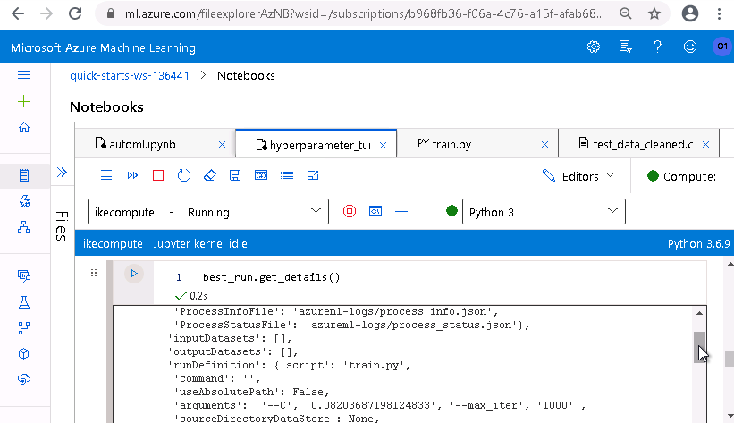
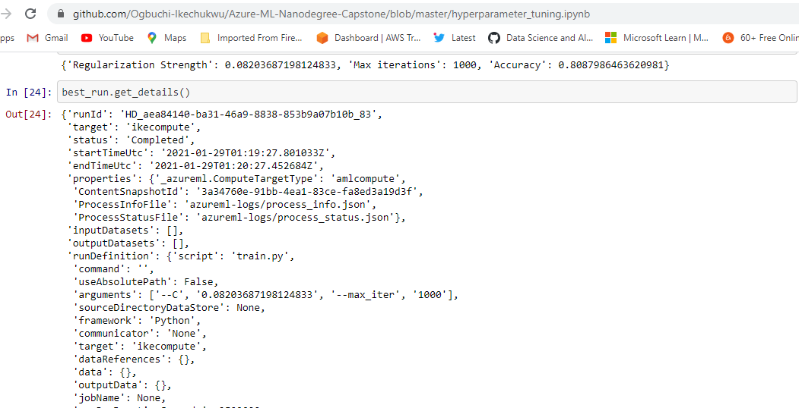

Best Runs
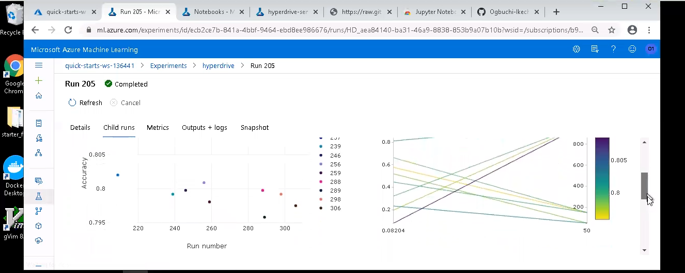
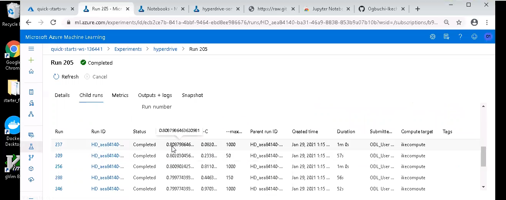


## Model Deployment

Model was successfuly deployed and could be interacted with through the provisioned endpoint. The sample input I tested with was in csv format, so I converted it to json using the code below and was able to get results from the scoring uri.
```python
  import requests
  import json
  scoring_uri = service.scoring_uri
  # If the service is authenticated, set the key or token
  #primary,secondary = aci_service.get_keys()
  #key = primary

  # Convert to JSON string
  x_test_json = x_test.to_json(orient='records')
  data = "{\"data\": " + x_test_json +"}"

  # Set the content type
  headers = {'Content-Type': 'application/json'}
  # If authentication is enabled, set the authorization header
  #headers['Authorization'] = f'Bearer {key}'

  # Make the request and display the response
  resp = requests.post(scoring_uri, data, headers=headers)
  print(resp.text)
  #resp = requests.post(aci_service.scoring_uri, data, headers=headers)

  y_pred = json.loads(json.loads(resp.text))['result']
```
The output to this request returned 3,070 results as numpy arrays which were shown in the notebook file.
## Screen Recording
Here is a link to my screen recording of the project: https://youtu.be/0vqXWCdNdJA


